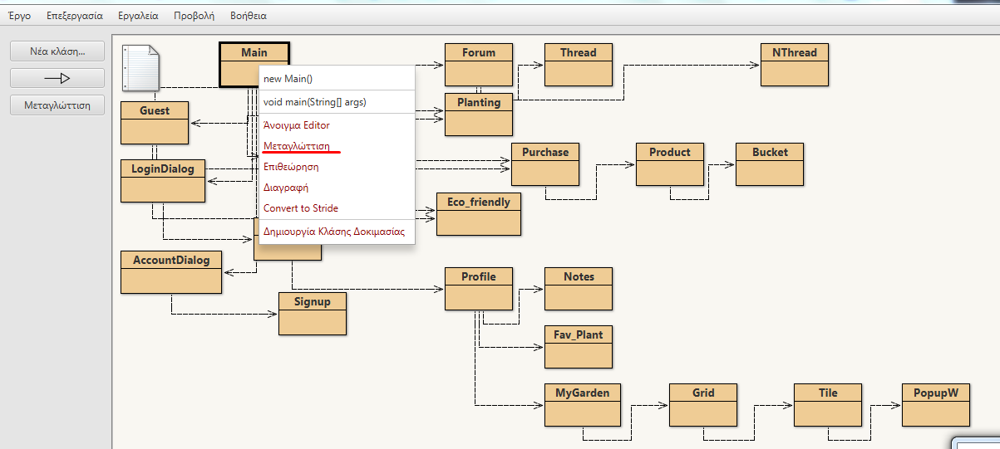
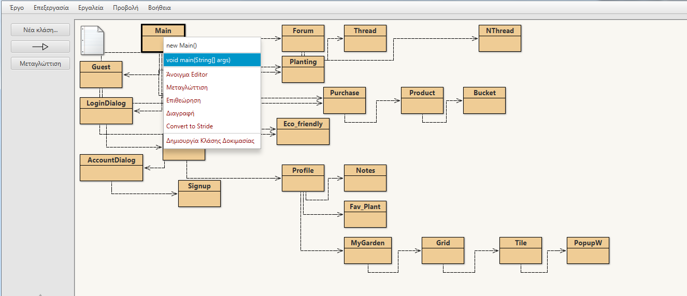

# Project for Software Engineering 

Το έργο αφορά μια εφαρμογή στην ελληνική γλώσσα για desktop, η οποία θα  εντάσσεται στη θεματική της αστικής κηπουρικής.

## Getting Started

These instructions will get you a copy of the project up and running on your local machine for development and testing purposes. See deployment for notes on how to deploy the project on a live system.

### Prerequisites

Ένα οποιοδήποτε IDE που να αναγνωρίζει JAVA. Προτείνουμε το Bluej στο οποίο αναπτύχθηκε το application.

### Executable
Για ευκολία έχουμε δημιουργήσει ένα exe το οποίο κατεβάζετε στο desktop σας χωρίς κάποια περαιτέρω εγκατάσταση.

### Downloading and compiling

Κατεβάζετε το project στο pc. Ανοίγετε το package του bluej που περιέχεται στο file κάνετε compile την main κλάση ώστε να δημιουργηθούν τα executable αρχεία για να τρέξει το application.

## Running the app

Για να τρέξουμε το app επιλέγουμε δεξί κλίκ στη Main και επιλέγουμε void main(String[] args)

## Built With

* [Dropwizard](http://www.dropwizard.io/1.0.2/docs/) - The web framework used
* [Maven](https://maven.apache.org/) - Dependency Management
* [ROME](https://rometools.github.io/rome/) - Used to generate RSS Feeds

## Contributing

Please read [CONTRIBUTING.md](https://gist.github.com/PurpleBooth/b24679402957c63ec426) for details on our code of conduct, and the process for submitting pull requests to us.

## Versioning

We use [SemVer](http://semver.org/) for versioning. For the versions available, see the [tags on this repository](https://github.com/your/project/tags). 

## Authors

* **Billie Thompson** - *Initial work* - [PurpleBooth](https://github.com/PurpleBooth)

See also the list of [contributors](https://github.com/your/project/contributors) who participated in this project.

## License

This project is licensed under the MIT License - see the 
 file for details

## Acknowledgments

* Hat tip to anyone whose code was used
* Inspiration
* etc
